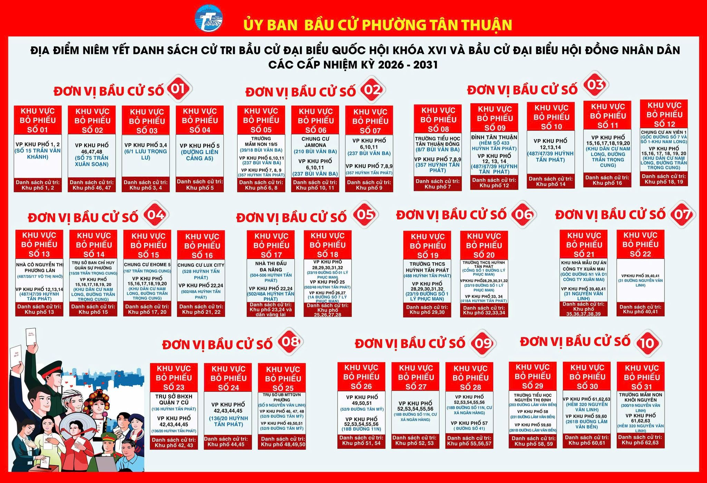

<!DOCTYPE html>
<html lang="vi">
<head>
<meta charset="UTF-8">
<title>Tra cứu bầu cử - Phường Tân Thuận</title>

</head>

<body>

    <h1>ỦY BAN BẦU CỬ PHƯỜNG TÂN THUẬN</h1>
    
Tra cứu danh sách cử tri và khu vực bỏ phiếu

<!-- ================= TRANG 1 ================= -->

    
TRA CỨU ĐỊA ĐIỂM BỎ PHIẾU

    <input type="text" placeholder="Vui lòng nhập khu phố của cử tri...">
     
    <button onclick="goPage(2)">TÌM KIẾM</button>

      
    

<!-- ================= TRANG 2 ================= -->

    
THÔNG TIN KHU VỰC BỎ PHIẾU

    
<b>Khu vực bỏ phiếu:</b> 27

    
<b>Đơn vị bầu cử:</b> 09

    
<b>Địa điểm:</b> VP Khu phố 52 - 56, số 18B đường 11N, P Tân Thuận, TP.HCM

     
    <button onclick="goPage(3)">XEM BẢN ĐỒ</button>
    <button onclick="goPage(1)">QUAY LẠI</button>

<!-- ================= TRANG 3 ================= -->

    
BẢN ĐỒ GOOGLE MAP

    

        <iframe 
        src="https://maps.app.goo.gl/Dy7FcJwDwi3Fvsvg8">
        </iframe>
    

    
HÌNH ẢNH VĂN PHÒNG KHU PHỐ

    

        
    

     
    <button onclick="goPage(2)">QUAY LẠI</button>

</body>
</html>
